# 校园

这章是一切社会关心的内容——进入学校后也许就忙着大学生活了。在大学校园内，你会潜心学习、研究技术或是按部就班地度过接下来的日子；但你走出学校后，大学生活便浓缩成一行白纸黑字的教育经历。

<!-- 总要能上课找到教室，也要能随时找到厕所吧。 -->

## 学校简介

> 西安邮电大学是一所**以工为主**，以信息科学技术为特色，工、管、理、经、文、法、艺多学科协调发展的普通高等学校，是我国特别是西北地区信息产业和现代邮政业人才培养、科学研究的重要基地。
>
> 西安邮电大学现有**在校本科生16000余人**，目前设有**49个本科专业**，形成了以工为主，工、管、理、经、文、法、艺多学科协调发展和信息科学技术优势突出的人才培养特色，是西北地区信息产业和现代邮政业人才培养、科学研究的重要基地。
>
> 学校分**雁塔校区和长安校区**两个校区办学，现设有通信与信息工程学院、纽黑文信息工程学院、“电子工程学院、集成电路学院”、“计算机学院、软件学院”、“人工智能学院、自动化学院”、“网络空间安全学院、密码学院”、经济与管理学院、现代邮政学院（物流学院、邮政研究院）、理学院、人文与外国语学院、马克思主义学院、数字艺术学院、体育部、国际教育学院、创新创业学院、就业学院、继续教育学院等二级教学单位。
>
> 西安邮电大学2003年获批硕士学位授权，2004年招收第一届硕士研究生，2021年招收第一届博士研究生。经过多年的建设发展，目前**各类在校研究生2700余人**，拥有12个硕士授权一级学科，7个硕士专业学位授权类别，1个陕西省“国内一流学科建设高校”建设学科，3个一级学科博士点，2020年通信工程学科入选软科世界一流学科。
>
> - [学校简介 - 西安邮电大学](https://www.xiyou.edu.cn/xxgk/about1.htm)
> - [本科生教育 - 西安邮电大学](https://www.xiyou.edu.cn/rcpy/bksjy1.htm)
> - [研究生教育 - 西安邮电大学](https://www.xiyou.edu.cn/rcpy/yjsjy1.htm)

西邮作为一所双非本科院校，位列“四邮四电”，部分企业认为其培养的学生具有“211”同等水平。

学校于2012年3月由“西安邮电学院”更名为“西安邮电大学”，2025年8月启动推免（推荐优秀应届本科毕业生免试攻读硕士学位研究生）报名工作。

## 各个校区

### 长安校区

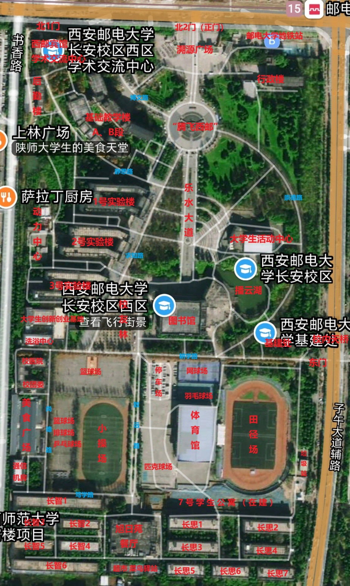
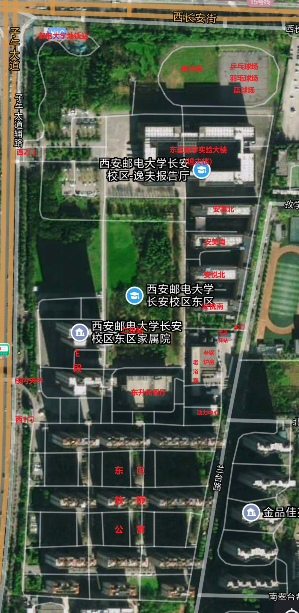

长安校区被子午大道分为西区和东区两部分，北邻西长安街，西邻书香路，东邻兰台路，南临学府大街和陕西省档案局，西区和东区之间可以通过十字路口马路或校内过街天桥通行。西区有北1门、北2门、东门，其中北2门为正门，北1门供西邮宾馆、学术交流中心使用，常年关闭。西区西侧美食广场为半开放式，也可出校园。东区有西1门、西2门、东门，其中西2门为正门，西1门供家属院使用，E段南侧还有个常年关闭的小门。东门仅隔壁长安区第三小学放学等期间开放，原则上不能进出。

下面第一张图为长安校区西区北2门和基础教学楼A栋，第二张图为东门。

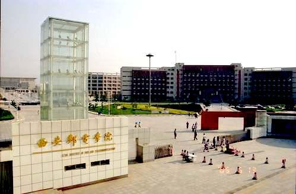

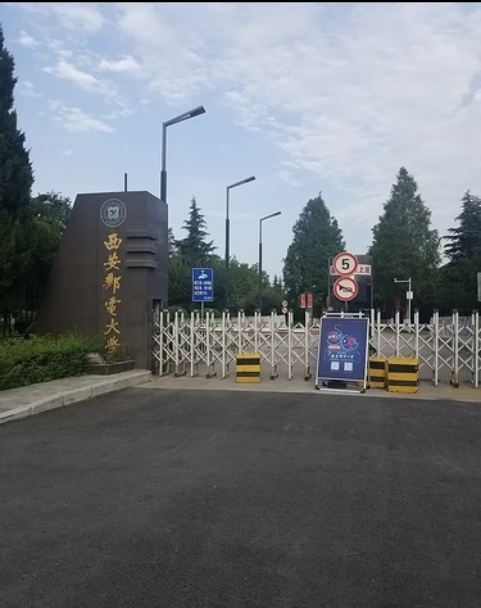

连接东西区之间的人行天桥分为校内和校外两部分，校内部分不允许电动车、自行车等进入，只允许步行。

15号线邮电大学地铁站在西长安街与子午大道交汇路口，入口位于校外，不能由校内直接进入。

图书馆旁有播云湖，相较之前已加装栏杆。播云湖上方横架一座桥，将湖分为两部分，一边养鸭鹅，一边种莲花。播云湖曾一直蔓延并横穿乐水大道，后期被回填。

#### 教学楼

- 西区有基础教学楼A和B，位于西区西北角，A段在北，B段在南。A段共7层，有小教室、外语视听教室、物理实验室等。B段共3层，为大教室。都没有电梯。
- 东区有教学实验大楼（也称为逸夫教学楼），共8层，各楼层形状不规则。
  - FF开头的是大教室，位于东侧；FZ开头的是小教室。由于FF段大教室的层高较高，所以FF段与FZ段的层数并不一一对应。
  - A口位于西北角，B口位于西南角，C口位于东北角，D口位于东南角，每个口都有电梯。4个角的入口在1\~4层不互相连通，5层及以上开始连通但5层为夹层没有FF段。
  - 1层为计算机院各实验室，A、B口部分1\~4层为纽黑文信息工程学院，D口2\~4层为“计算机学院、软件学院”，A、D口部分5层为“网络空间安全学院、密码学院”，6层为数字艺术学院，7层为马克思主义学院。8楼有研究生自习室、各院实验室、微机教室、学报编辑处等。中间1\~2层有逸夫报告厅。
  - 如果找不到教室，可以关注 <Tip copy>隔壁小O</Tip> 公众号（[使用指南](https://mp.weixin.qq.com/s/CZR_d2SmltiZyl-oCz3zhA)）。
- 西区有图书馆，共5层半，有自习室、借阅室、图管会、信息中心、某些实验室等。图书馆有个裙楼，有通信管、微机教室、国会报告厅、自主学习空间（自习室）等。

下面第一张图为图书馆和前方的乐水大道，第二张图为长安校区东区西2门和逸夫教学楼。

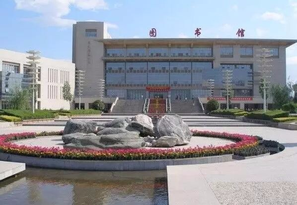

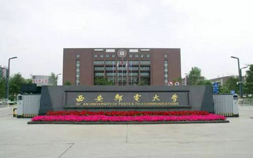

#### 实验楼
- 西区求知路上有1\~3号实验楼。1号实验楼北半侧为理学院，南半侧为“人工智能学院、自动化学院”。2号实验楼为“电子工程学院、集成电路学院”。3号实验楼为通信与信息工程学院。
- 西区老锅炉房被改造为大学生创新创业孵化基地的一部分。
- 东区老浴室共3层，目前被改造为实验楼。E段的一部分供就业学院使用。

#### 食堂

*   西区有旭日苑和美食广场两个食堂。旭日苑共3层，民族餐厅在3层，其周围还有打印店、二手书店、商店和奶茶店等。美食广场已经过改造，分为校内和校外部分，校内部分为1层，校外部分为2层，两部分之间有闸机。
*   东区有东升苑一个食堂，共4层，1、2层为食堂，3、4层为办公用地，外侧有个民族餐厅。

#### 住宿与生活

*   西区目前启用了长智1\~6和长思1\~7，目前在建7号学生公寓楼，该楼暂未命名。东区目前启用了安悦、安美宿舍楼群，相连但不互通。他们都为6层，特别地在建的7号宿舍楼还有1层地下层。西区宿舍目前只有独卫，洗澡需要到洗浴中心。
*   西区旭日苑后有大学生服务中心，内部以超市和理发店等为主，老水房改造为零食店。
*   东区南侧为我校家属院，E段也归为家属院13号楼。东区宿舍楼内1楼有浴室，热水曾由空气源热泵提供，老浴室被废弃，改为实验楼。
*   东西区分别有个菜鸟驿站。

下面第一张图为长安校区东区安悦、安美宿舍楼群，第二张图为西区旭日苑餐厅。

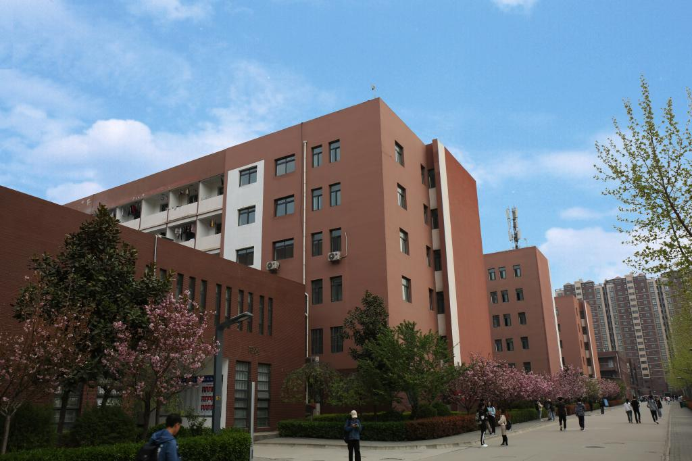

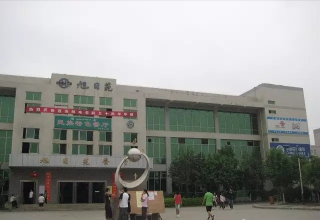

#### 体育设施

*   西区有个标准田径场和小运动场（不标准），室外有4个网球场、12个羽毛球场、匹克球场、篮球场、排球场、乒乓球场，体育馆室内有篮球场和个别排球场、羽毛球场。
*   东区有简陋的田径场，跑道为沥青的、足球场是野草，也有水泥地的乒乓球场、羽毛球场、篮球场。老锅炉房正在改造为体育用地。逸夫楼内有露天的1个羽毛球场和1个废弃的乒乓球场。

下图为西区体育馆前。

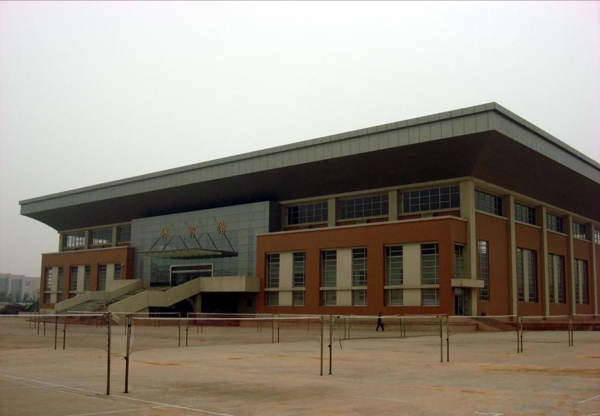

### 雁塔校区

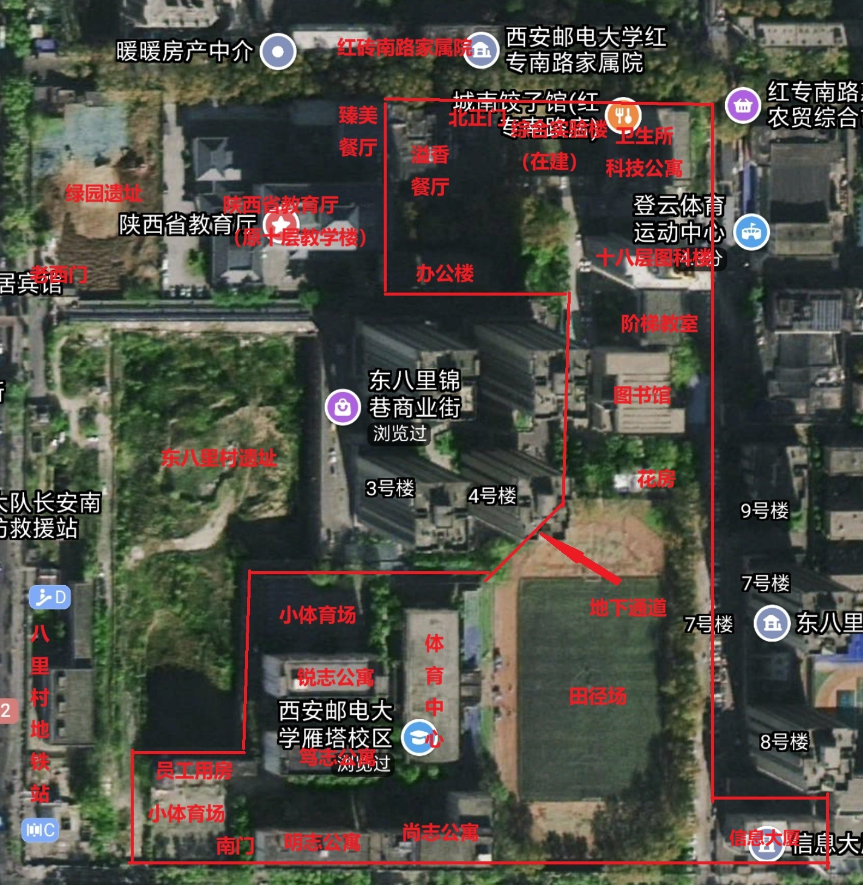

雁塔校区为老校区，占地面积小。雁塔校区北邻红砖南路，西侧半包围东八里村遗址，南邻雁南一路。雁塔校区目前有北门和南门，其中北门为正门，南门只供行人进出。老西门曾为雁塔校区正门，现已被封锁，门口为邮电大学人行天桥，对面为西八里村。南门外距离2号线八里村地铁站较近。

花房西侧地下通道入口有“智慧之源”雕像。

下图为北门。

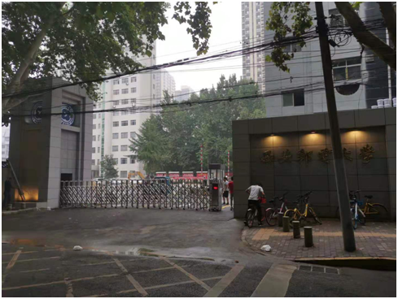

下面第一张图片为雁塔校区老西门改造前和十层教学楼（十八层图科楼当时暂未建成），第二张图片为老西门改造前和被陕教厅修缮后的十层教学楼、十八层图科楼，第三张图片为老西门现状。

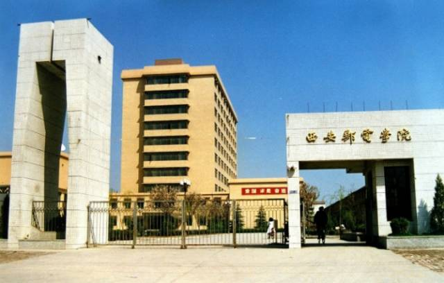

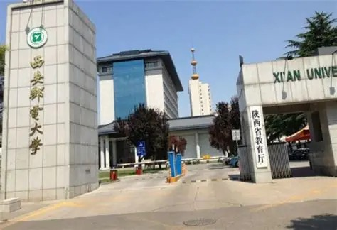

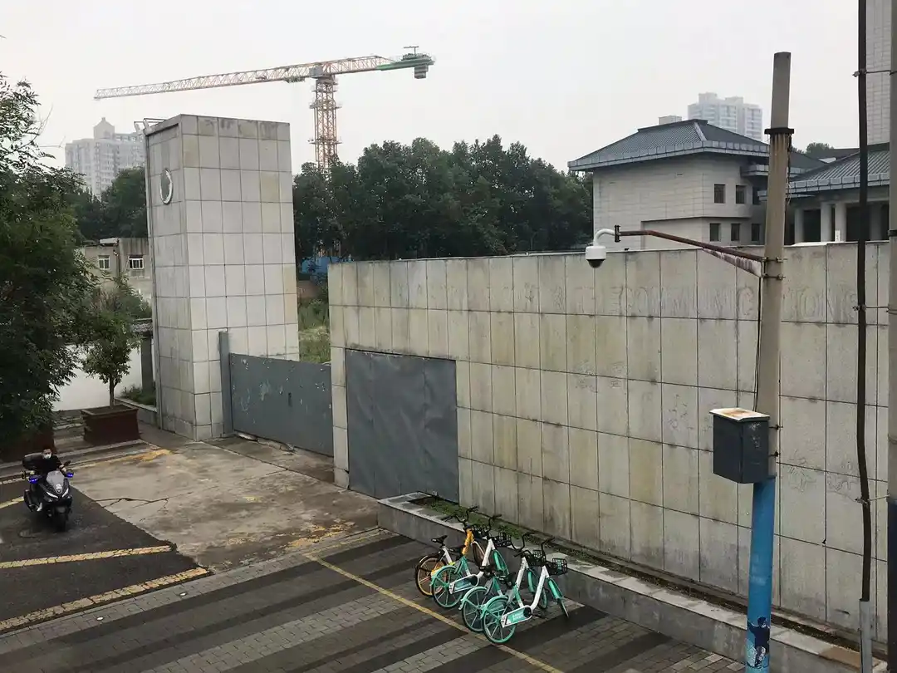

#### 教学楼

*   雁塔校区只有一栋教学楼，分为3部分，从北向南为十八层图科楼、B段阶梯教室和图书馆。十八层图科楼有18层地上层和2层地下层，地上1\~8层为小教室，9\~18层为外语视听教室、研究生实验室等，有电梯，传言曾经是雁塔区的最高楼。B段阶梯教室和图书馆都为5层，B段有电梯。
*   北门旁老锅炉房和水房已被拆除，正在建设新的综合实验楼，共6层。
*   雁塔校区的信息大厦供继续教育学院使用。
*   雁塔校区旁的陕西省教育厅原为我校十层教学楼，后被转让，目前与我校之间有铁栅栏分隔。陕教厅西侧为我校原绿园遗址，后陕西省教育厅搬来后被夷平，目前被划归市政用地。“智慧之源”雕像曾位于十层教学楼西侧，正对老西门，后因失去此部分土地才被搬迁。

下面第一张图为十八层图科楼，第二张图为“智慧之源”雕像拆迁前。

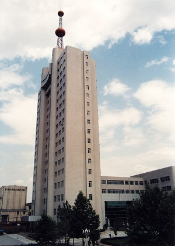

#### 食堂

*   雁塔校区原有学生餐厅和教职工餐厅，分别为溢香餐厅和臻美餐厅。溢香餐厅共2层，2楼原为图书馆，后被改为餐厅。臻美餐厅1楼为民族餐厅，2楼及以上为某些后勤部门，现已划归陕教厅。

#### 住宿与生活

*   供4栋学生宿舍楼，分别为尚志、明志、笃志、锐志公寓。笃志、锐志公寓曾为小体育场，它们为后期建造，原女生宿舍被改为办公楼，供经济与管理学院、现代邮政学院（物流学院、邮政研究院）、人文与外国语学院（含边防子女预科班）等使用。
*   宿舍楼内部都有楼内浴室。
*   北门路对面还有2栋原属于我校的红砖南路家属院，南门附近还有员工宿舍楼，它们现状未知。

下面三张图为绿园被拆除前的景色。

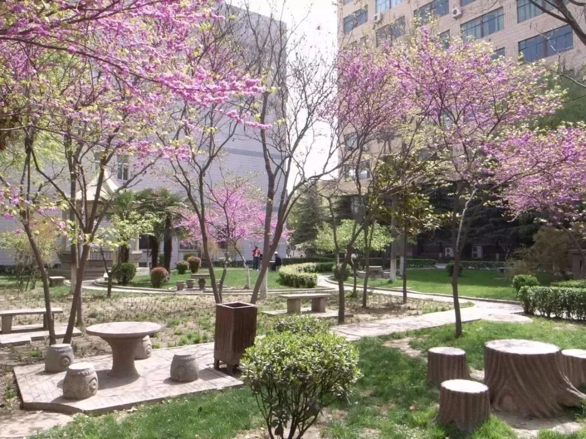

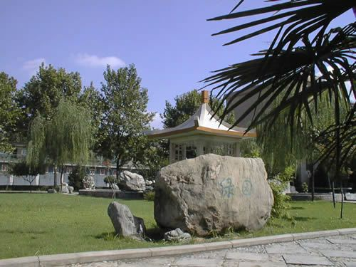

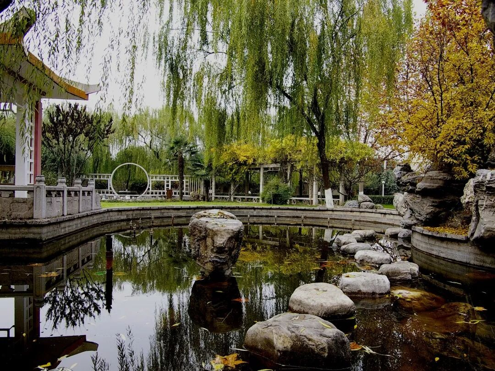

#### 瑞禾村校区

在雁塔校区建成前，我校校址在今电信十所，在雁塔校区东边不远处，目前原主教学楼暂未拆除，仍在红砖南路路北。

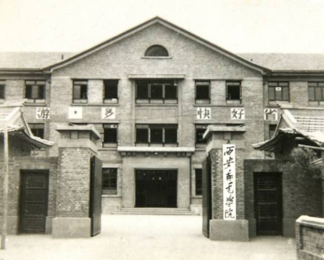

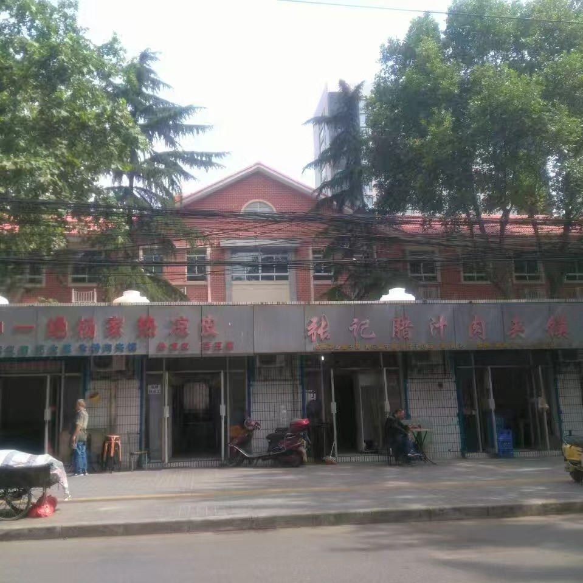

## 校区通勤

:::tip 参考
- [后勤服务产业集团 - 通勤班车运行时间表](https://hqjt.xupt.edu.cn/info/1031/3358.htm)
  :::

长安校区与雁塔校区之间的通勤班车，学生和老师都可以免费乘坐，但随着地铁15号线的开通，据说2026年新生入学后可能要取消该通勤班车，建议以最新政策为准。

另外，可以使用手机地图 APP 查询合适的通勤方案。
